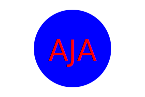

# SVG-Logo-Maker

Link to logo creator video:

https://drive.google.com/file/d/1U3G4hGdNyR45EZ4elUO9PEbAhOw7ypoN/view

 ## Description
  Creates an SVG logo by answering a series of questions. Once all questions have been answered, a logo will be generated using the answers provided by the user.

  ## Installation
  - Jest (For testing)
  - Inquirer

  ## Usage
  Run the command "node index.js" for the list of questions. First, the user is asked how many characters of text they wish to add inside the shape (max of 3 characters). Second, the user is asked to input their preferred color of text. The user is then asked to select from one of the three shapes: Circle, Square, or Triangle. Lastly, the user is asked to select the color of the shape.

  ## Contributing
  N/A

  ## Tests
  To run testing for "shapes.test.js" and "svg.test.js", open the terminal, and use the command "npm run test".

  Link to video of tests:

  https://drive.google.com/file/d/14ncIswumHx_4fD_UjF92yQ3OmPgV5oPE/view

  ## Questions?
  Feel free to ask any questions you may have by reaching out to the following:

  Github: https://github.com/Austin1094
  Email: Austin.Adams1094@gmail.com